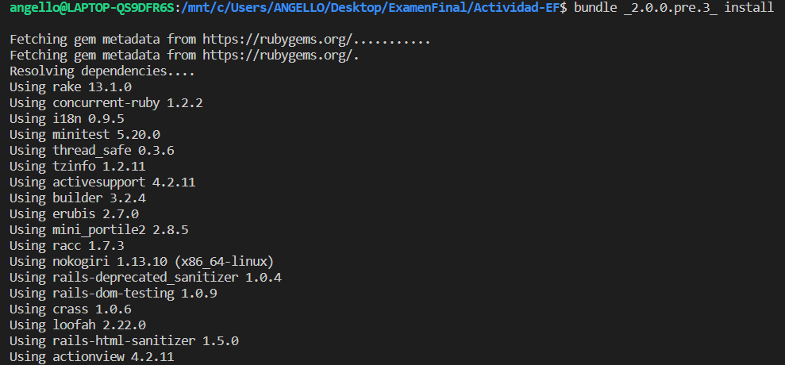
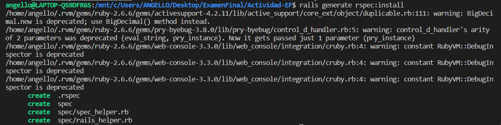
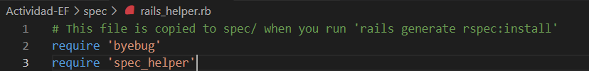
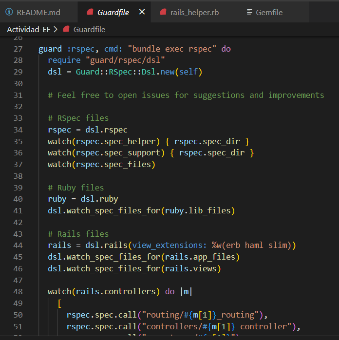
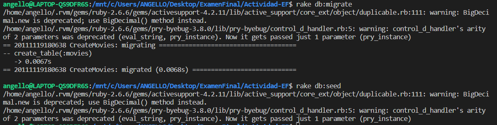
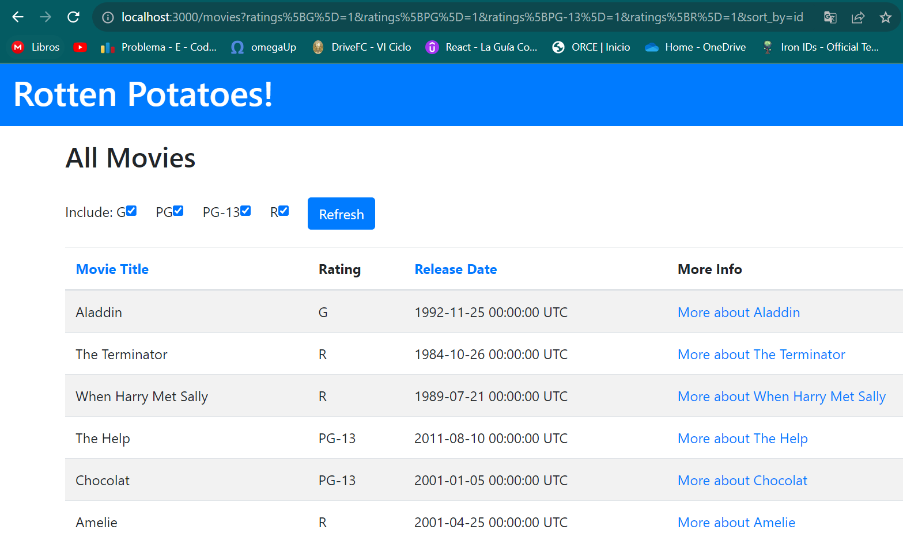

# Parte 1

Parte 1
Estas preguntas corresponden a las actividades desarrolladas en clase.

1.	Produce un conflicto de fusión (merge) en algún repositorio de tus actividades realizadas. Establece los pasos y comandos que usas para resolver un conflicto de fusión en Git. Si intentas git push y falla con un mensaje como : Non-fast-forward (error): failed to push some refs esto significa que algún archivo contiene un conflicto de fusión entre la versión de tu repositorio y la versión del repositorio origen. Para este ejercicio debes presentar el conflicto dado, los pasos y comandos para resolver el problema y las solución.


## 2.	Digamos que nos dan el modelo de User de la siguiente manera: 
```ruby
class User < ActiveRecord::Base
validates :username, :presence => true
validate :username_format
end
```

1. ¿Qué pasa si tenemos @user sin nombre de usuario y llamamos a @user.valid? ¿Qué 	guardará @user.save 

Si poseemos una instancia @user sin un nombre de usuario y ejecutamos @user.valid? según lo indicado en la pregunta, el resultado que obtendremos será false. Esto se debe a que la validación requiere que el campo username no esté vacío. Si intentamos guardar @user utilizando @user.save, la operación fracasará y devolverá false. Esto ocurre porque no se permite almacenar registros en la base de datos si no cumplen con la validación mencionada anteriormente.

2. Implementa username_format. Para los propósitos, un nombre de usuario comienza 	con una letra y tiene como máximo 10 caracteres de largo. Recuerda, las validaciones 	personalizadas agregan un mensaje a la colección de errores.

```ruby
def username_format
  if username.present? and not username.match(/^[a-z]+$/i)
    errors.add(:username, "solo debe contener letras")
  end
  if username.length < 1 && username.length > 10
    errors.add(:username, "La longitud es menor a 10")
  end
end
```

Validamos que el nombre solo debe contener letras y además que el nombre tenga entre 1 y 10 caractere y en caso no cumple se agrega un mensaje de error.

3.	Recuerda, los filtros nos ayudan a verificar si ciertas condiciones se cumplen antes de permitir que se ejecute una acción del controlador. Para el modelo de User, digamos que queremos verificar si @user era administrador de todos los métodos en AdminController. Completa el método before_filter:check_admin a continuación que verifica si el campo de administrador en @user es verdadero. De lo contrario, redirija a la página admin_login con un mensaje que indica acceso restringido.
```ruby
class AdminController < ApplicationController
  	        before_filter :check_admin
      # Completa el codigo
```
Agregamos un metodo ``check_admin``

```ruby
def check_admin
    unless current_user.admin?
      flash[:alert] = "Acceso restringido"
      redirect_to movies_path
    end
  end
```

Si es que el usuario no es admin, lo redirigirá a la pagina principal y le mostrará un mensaje `ACceso restrngido`.

4.	 AJAX (JavaScript y XML asíncronos) es un grupo de herramientas y técnicas para el desarrollo de aplicaciones web asíncronas. El objetivo de AJAX es que la comunicación entre una aplicación y el servidor de datos (es decir, solicitudes HTTP) no interfiera con la experiencia, la visualización y el comportamiento de la aplicación. A continuación, se te proporciona un formulario que simula el inicio de sesión. Comprueba si la combinación de nombre de usuario y contraseña funciona junto con la cuenta, si la hay. Para hacer eso, queremos que se realice una solicitud HTTP POST cuando se envíe este formulario. Escribe tu solución con jQuery y comenta dónde debe ubicarse la función de devolución de llamada (callback). Comprueba tus resultados.

```html
<form method="POST" id="foo">
    <input type="text" class="user" />
    <input type="password" class="pass" />
    <input type="button" value="Log␣in" id="onSubmit" />
</form>
$("#onSubmit").click(function() {
# Tu codigo
})
```
5.	¿Cuándo deberías utilizar la metaprogramación basada en eval en lugar de la metaprogramación basada en bloques?.

La metaprogramación basada en eval se utiliza cuando necesitamos ejecutar código en forma de cadena en tiempo de ejecución. Puede ser útil cuando queremos generar y ejecutar código de forma dinamica, pero debemos tener cuidado con la seguridad ya que .
En cambio la metaprogramación basada en bloques se utiliza cuando queremos manipular y generar código utilizando objetos y métodos. Es más legible y seguro que la metaprogramación basada en eval.

Unn ejmplo simple:

```ruby
# Basada en eval
codigo = "puts 'Examen Final'"
eval(codigo) # Imprime "Examen Final"

# Basada en bloques
define_method :hola do
  puts 'Examen Final'
end

hola # Imprime "Examen Final"
```

# Parte 2: Pruebas
Editamos el Gemfile para incluir las siguientes gemas:
```ruby
gem 'faraday'  
group :test do
  gem 'rails-controller-testing'
  gem 'guard-rspec'                 
end
```
Y ejecutamos bundle install:



Luego ejecutamos ``Rails generate rspec:install`` para asegurarnos de los archivos RSpec.



Añadimos require '``byebug'``  en ``spec/rails_helper.rb``



Ejecutamos el paquete ``exec guard init rspec`` rspec para configurar los archivos necesarios para Guard.

Y podemos ver nuetro ``Guardfile``:



Ahora configuramos nuestra base de datos con los comandos ``rake db: migrate/ rake db:seed``:



Y al ejecutar `rails server` podemos ver nuestro proyecto:



### Paso 1: Escribiendo una nueva vista  

Lo primero que haremos sera crear la vista correspondiente:

Modificamos de la siguiente manera la vista ya creada `search_tmdb.html.erb`:

```html
<script src="https://cdn.jsdelivr.net/npm/bootstrap@5.0.2/dist/js/bootstrap.bundle.min.js" integrity="sha384-MrcW6ZMFYlzcLA8Nl+NtUVF0sA7MsXsP1UyJoMp4YLEuNSfAP+JcXn/tWtIaxVXM" crossorigin="anonymous"></script>
<link href="https://cdn.jsdelivr.net/npm/bootstrap@5.0.2/dist/css/bootstrap.min.css" rel="stylesheet" integrity="sha384-EVSTQN3/azprG1Anm3QDgpJLIm9Nao0Yz1ztcQTwFspd3yD65VohhpuuCOmLASjC" crossorigin="anonymous">


<h2>Search in TMDb</h2>
<%# Part 5 here %>

<div class="search-container">
<%= form_tag search_tmdb_path, method: :post, id: "tmdb_form" do %>
    <label for="searchMovieName">Movie Name</label>
    <%= text_field_tag 'title', nil, class: "form-control", id: "movie_title_field", placeholder: "Manhunter"%> 
    <label for="searchReleaseDateField">Release Year</label>
    <%= text_field_tag 'release_year', nil, class: "form-control", id: "movie_year_field", placeholder: "1986"%>
  
  <div class="form-check">
    <%= radio_button_tag 'language', 'en', false, class: "form-check-input" %>
    <label class="form-check-label" for="language_en">English Only</label>
  </div>

  <div class="form-check">
    <%= radio_button_tag 'language', 'all', true, class: "form-check-input" %>
    <label class="form-check-label" for="language_all">All Languages</label>
  </div>
  <%= submit_tag 'Search', id: 'tmdb_submit', class: 'btn btn-warning col-2' %>

<% end %>
  
<%= link_to 'Volver', movies_path, class: 'btn btn-primary mt-3' %>
</div>
```

En `<%= form_tag search_tmdb_path, method: :post, id: "tmdb_form" do %>` hemos agregado el método ``:get`` al ``form_tag `` para indicar que la solicitud será de tipo ``POST``. Tambien le agregamos un ``id`` al formulario.

En `<%= link_to 'Volver', movies_path, class: 'btn btn-primary mt-3' %>` hemos agregado el botón "Volver" usando el helper ``link_to``.

Ahora procedemos a modificar nuestro `index.html.erb` para generar un boton que nos lleve a esta nueva vista creada:

```html
<div class="col-md-2">
    <%# Part 1 here %>
    <div class="col-md-2">
    <%= link_to 'Search in TMDb', search_tmdb_path, class: 'btn btn-primary' %>
  </div>
  </div>
```


Una vez creada la vista, procedemos a modificar el controlador `movies_controller.rb`: